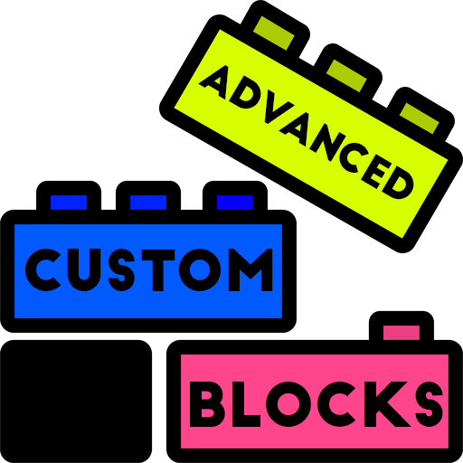
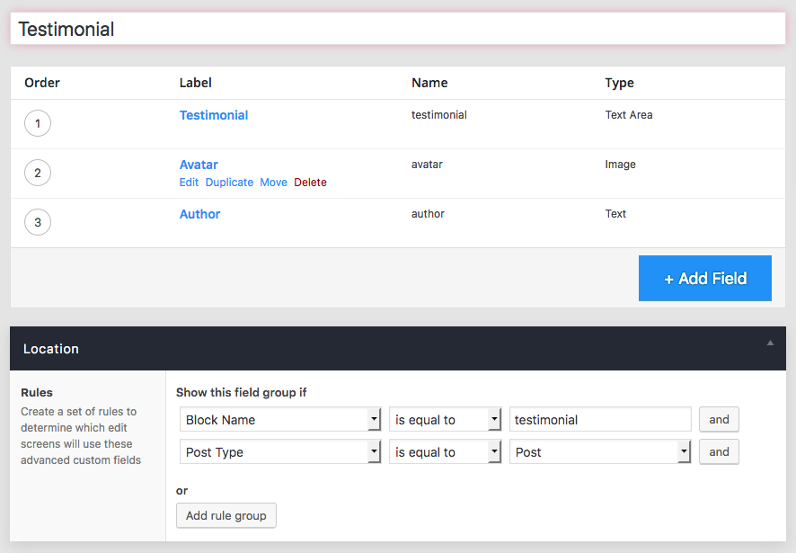
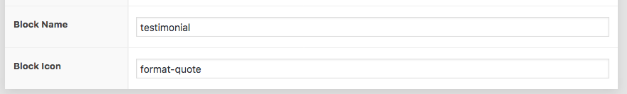
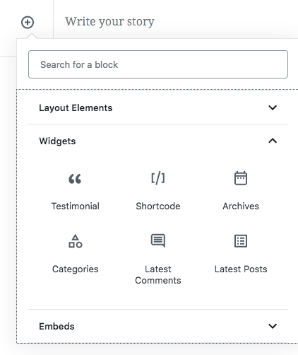
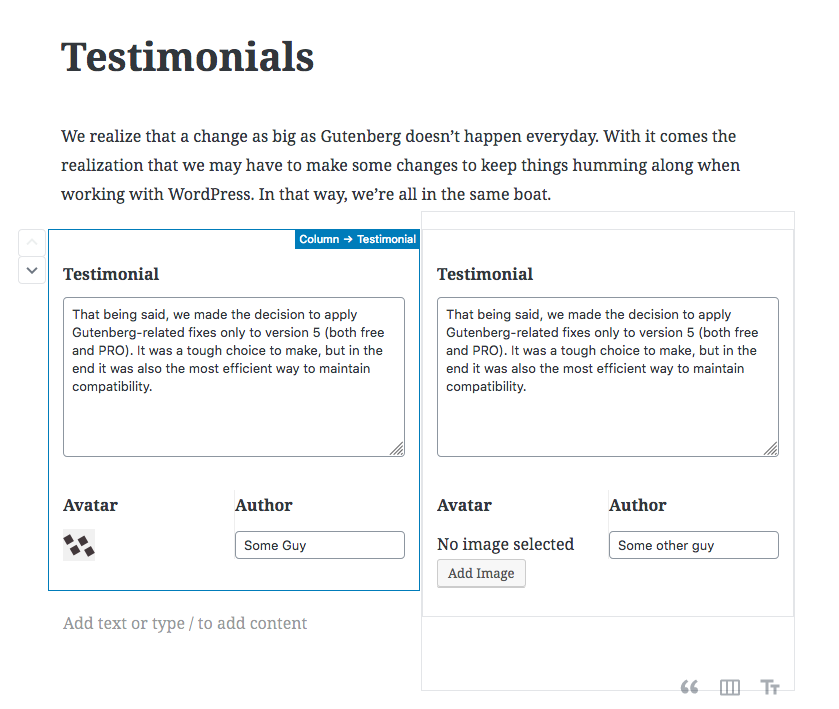

# Advanced Custom Blocks

Create custom blocks for the new Wordpress [Gutenberg editor](https://github.com/WordPress/gutenberg) using [Advanced Custom Fields](https://github.com/elliotcondon/acf). 




<p align="center">
<a href="#key-features">Key Features</a> •
<a href="#installation">Installation</a> •
<a href="#how-to-make-a-block">How to make a block</a> •
<a href="#how-to-use-the-block">How To Use The Block</a> •
<a href="#credits">Credits</a> •
<a href="#related">Related</a> •
<a href="#license">License</a>

</p>

## Motivation
Make an easy straightforward way for Wordpress developers to create custom Gutenberg blocks using a pipeline they are already familiar with. 

## Key Features
This plugin adds ACF field group location rules for targeting Gutenburg blocks.

A gutenburg block is currently targeted by type name (`core/paragraph`, `core/latest-posts`, etc.)

Once a block is targeted, the field group will appear when editing the targeted block.

Where the fields appear on the post edit screen is currently determined by the field group's "Location" setting.

- Normal - Fields will appear inside the block, below all other nested content/blocks
- High (below title) - Fields will appear inside the block, above all other nested content/blocks
- Side - Fields will appear in the side bar settings under the "Block" tab

## Installation

Download the zipped folder from Github, and then [install manually to Wordpress via upload](https://themetry.com/docs/install-wordpress-plugin-zip-upload/) in the admin interface. 

## How to make a block
1. First create a custom field group in ACF and set the location rules to target the block. 

 

2.  Next, at the bottom of the field group page you can set the block name, and the icon that will appear in the Gutenberg block menu. 

 

3. Create `testimonial.php` inside of the `blocks/acf/` directory within your theme

   ```
     <div class="testimonial">
       " />
       <h3><? the_field('author'); ?></h3>
       <span><? the_field('testimonial'); ?></span>
     </div>
   ```
   

## How to use the block

It's really simple! Just add the block when from the normal Gutenberg insert block menu when writing a post. 

 

And you can add multiple blocks of the same kind, similar to the repeater field. 

 


## Rendering block content

Here are the ways in which Advanced Custom Blocks will load block content:

```php
# Prepend
do_action("acf/before_render_block",  $attributes);
do_action("acf/before_render_block/name=$block_name", $attributes);


# Block content actions
do_action("acf/render_block", $attributes);
do_action("acf/render_block/name=$block_name", $attributes);


# Block content templates
include(get_template_directory() . "/blocks/acf/$block_name.php");
include(get_template_directory() . "/blocks/acf-$block_name.php");


# Append
do_action("acf/after_render_block", $attributes);
do_action("acf/after_render_block/name=$block_name", $attributes);
```


## Contribute

Please contribute! Just fork this repo and make a pull request. 


## TODOs:

* Create a "Block" field type so that we can have inner blocks as fields
* Location rules for block placement and quantity restrictions
* Sidebar positioning for block field groups

## Credits

See [this thread](https://github.com/elliotcondon/acf/issues/622) for original project discussion.

Project by [Robbie Chipka](https://github.com/rchipka)

Logo by [David Aslan French](https://github.com/thedonquixotic) (forked from [Darius Dan](https://www.flaticon.com/authors/darius-dan) ) 


